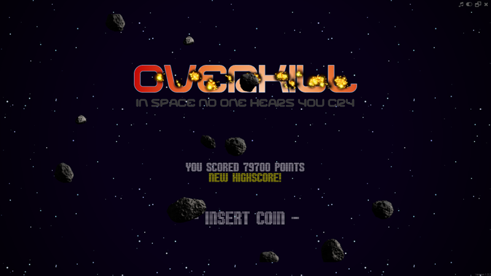

# Overkill - A retro space shooter
A simple space shooter based on the WADE game engine. Separated in five tiers with increasing difficulty and different enemies. Your energy gets 100 hit points on top after each tier, so when reaching the last tier try to stay alive as long as possible, because your energy won't be reset. The more energy you save at the beginning, the more you have when you reach the last tier. The huge spacestation in tier five is very strong. Also try to avoid flying into asteroids. They cause huge damage.

## Screenshot

## Features
- Beautiful, animated retro graphics
- Parallax starfield background
- Multiple enemy types with different strength and fire rate
- Basic health, score and level logic
- Per-pixel collision logic
- Highscore table
- Different power-ups to support you on your mission

## Usage
Use your mouse to move the spaceship around and click to fire. Your health gets restored and your fire rate is increased as you advance to the next level. Required hit points vary from enemy to enemy. Also larger asteroids must be shot multiple times before they are destroyed. In general the more shots required, the higher will be the reward.

## Compatibility
The game will run flawlessly in any modern browser. Even older browsers should work pretty well, if they support the 2d canvas feature. No WebGL support required, but supported and used by default. Audio (in-game sounds and music) is supported by all modern browsers, but the Internet Explorer stops the background music upon page reload. However, you may turn it on manually by clicking the respective button in the top right. Also keep in mind that Google changed the way web audio can be used in Chrome 65 an above. You have to explicitly click to enable audio. Due to this limitation background music won't play automatically any longer in Chromium based browsers. But you can still toggle it on/off using the button in the top right corner.

## Installation
- Enter your database credentials into the connect.sample.php file and rename it to connect.php.
- Initialize your database by executing create_schema.sql in the sql folder. Currently only MySQL is supported. PostgreSQL and other databases should work out of the box if you modify the schema, but I didn't test it, yet.
- Open up your web browser and visit the URL where your deployed the game to.

You can also run the game without a database. In such case the highscore table won't work and the highest score is stored in the local storage of your browser. I don't plan to use the local storage any further or to add support for the indexed database. 

## Demo
Play the latest stable version of the game on https://rekow.ch/overkill/ for free.

## Thanks
This game makes use of the following frameworks, plugins, resources and technology. In alphabetical order.
- [FontAwesome](https://fontawesome.com)
- [Jean-Christophe Nicolas (vonKristoff)](http://bite-software.co.uk/starscroll/)
- [Jeff Starr](https://perishablepress.com/block-bad-queries/)
- [jQuery](https://jquery.com)
- [MySQL](https://mysql.com)
- [PHP](https://php.net)
- [Thomas Tamblyn (Lorc)](http://lorcblog.blogspot.com/)
- [WADE game engine](http://clockworkchilli.com)

Thank you for making this game possible!
